# CIS-641-TechPirates

It's an individual and sustainable shopping platform, showing the need for ecological consumers in this new generation of e-commerce websites. It would have the ability to recommend preferred products, make sustainable product offerings, and provide value chain transparency based on users' preferences. Furthermore, while promoting a range of different ethically sourced and eco-friendly products, it will put the platform in a position where it can enable active choices on behalf of users by providing detailed information regarding the environmental and social impact of their purchase.

# Team Members and Roles

* [Alekhya Vaddineni](https://github.com/Alekhya2024/CIS641-HW2-Vaddineni)(Frontend Developer)
* [Akhila Thota](https://github.com/akhilathoota6/CIS641-HW2-Thota)(Backend Developer)
* [Geethanjalai Nalla](https://github.com/GeethanjaliNalla/CIS641-HW2-Nalla.git)(Database Developer)

# Prerequisites

Technical Skills: Web Development, Database Management, API Integration, Personalization Algorithms
Design and User Experience: UI/UX Design, Wireframing and Prototyping, User Testing
Project Management Skills: Task Management Tools, Agile Methodology, Collaboration and Communication
E-commerce and Sustainability Knowledge: E-commerce Basics, Sustainability Practices, Supply Chain Transparency
Marketing and Community Engagement: Digital Marketing, Community Building, Branding

# Run Instructions

Personalization Features
Sustainability and Transparency Features
Testing
Sustainability Practices

# Installation Steps

# ❖ Install NodeJs ( Ignore If Already Installed)
 1. Visit the official Node.js website i.e) https://nodejs.org/en/download/
 2. Download the Node.js installer
 3. Run the installer.
 4. Follow the prompts in the installer.

  —First Run Backend then Frontend & Admin—

 # ❖ Steps To Setup Backend Of The Project

 1. OpenProject Folder In VS Code
 2. OpenIntegrated Terminal
Right Click on ‘backend’ > Select “Open In Integrated Terminal”
 3. Type “npm install” and press Enter and Wait for Installation to be completed
 (requires Internet)
 
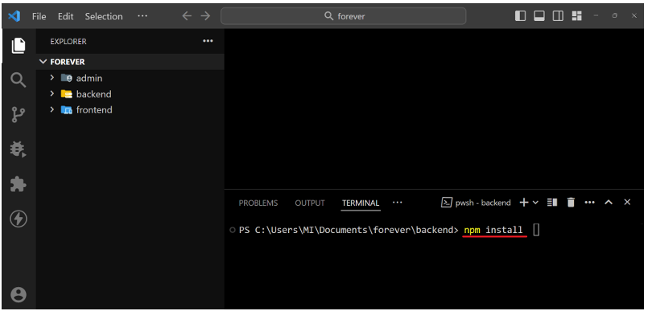

 5. Setup Cloudinary for file storage.
 Create account and login to: https://cloudinary.com/
 The go to Dashboard

 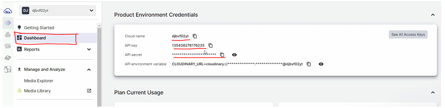

 Copy and paste the Cloud Name, API Key, And Secret Key in the
 backend / .env file:

 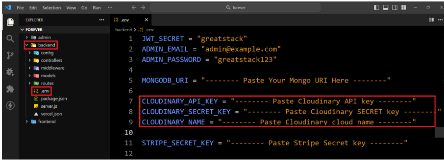

 6. Setup The MongoDB
 a. Open this link- [LINK](https://www.mongodb.com/cloud/atlas/register)

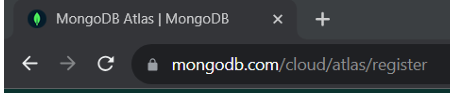

 b. After that Sign Up on the website.

 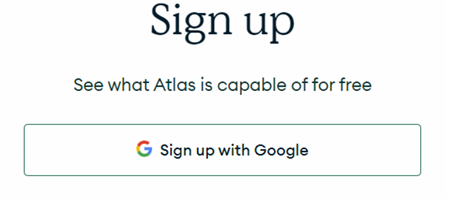

 c. Click on New Project Option

 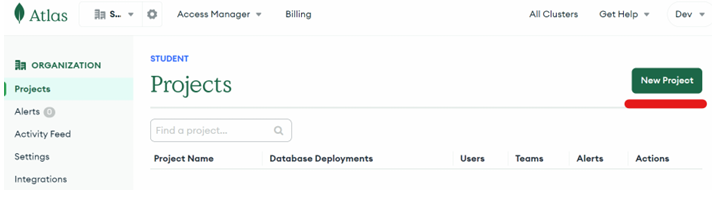

 d. After Creating Project go to Database Section & Build a database

 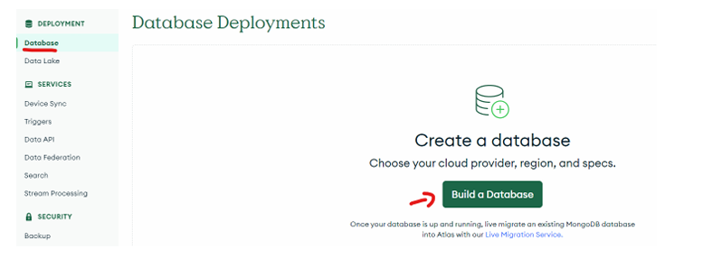

  e. Select M0 & Your Region & Create Database

  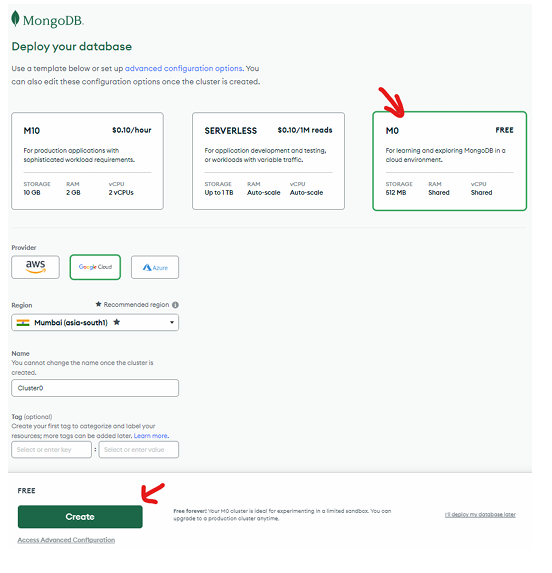

  f. Setup Username & Password & Create User

  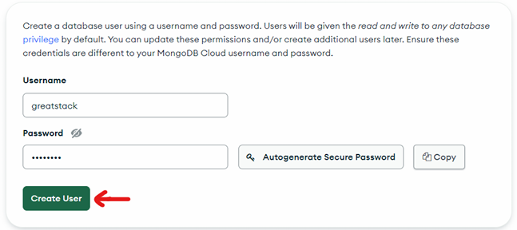

   Note: Do not use ‘@’ symbol in the password

 g. NowClick on Finish & Close

 h.Whitelist IP0.0.0.0&ClickonAddEntry

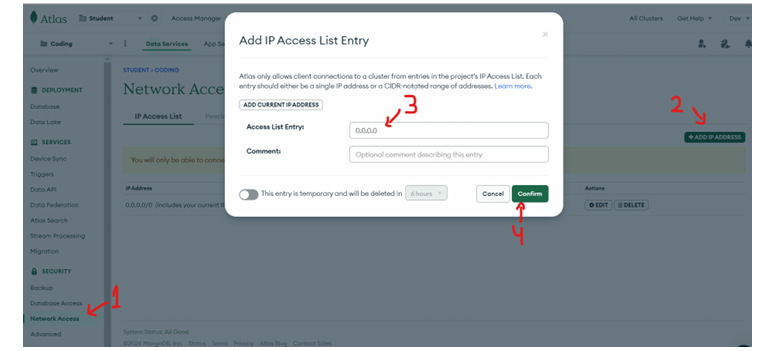

i. NowClickonConnect

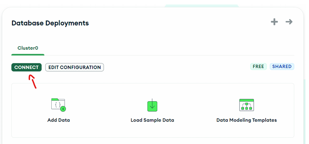

j. NowSelectCompassOption

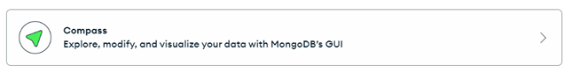

k. AndCopytheConnectionString

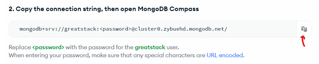

l.And Paste It in the backend / .env file and replace the <password> with
 the password you set previously in 4.F & save changes.

 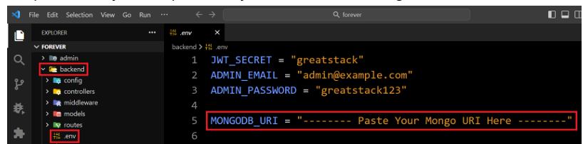

 ● Inmongodb uri don’t add ” / ” in the end

 7. Setup Stripe ( Optional )
 a. create a stripe account from here
 b. After creating account get the Stripe Secret Key from dashboard
 c. Paste the Secret Key in backend / .env file and save file

 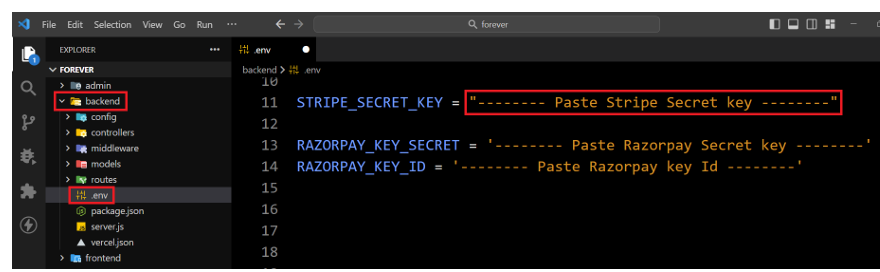

 8. Setup Razorpay( Optional )
 a. create a razorpay account from here
 b. After creating account get the Razorpay Secret Key & Razorpay Key ID from
 dashboard
 c. Paste the Secret Key in backend / .env file and save file

 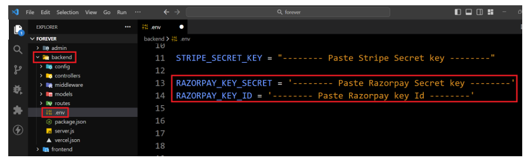

 9. To Run Backend use npm run server command in Integrated Terminal

 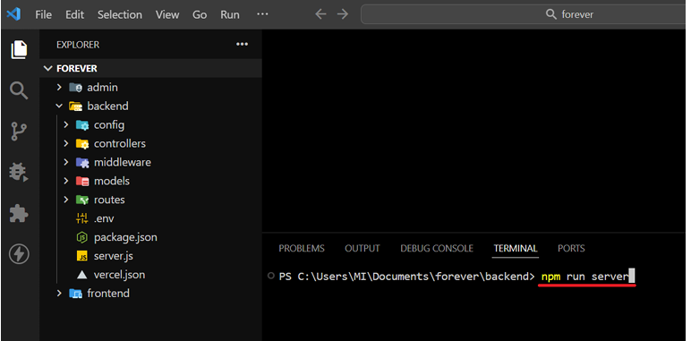

  >>> Before Running Frontend or Admin Projects make sure Backend is
 Running in the background terminal

  # ❖ Steps To Run Frontend of The Project

 1. Right Click on ‘frontend’ folder > Select “Open In Integrated Terminal”
 2. Type “npm install” and press Enter and Wait for Installation to be completed
 (requires Internet)
 3. After that type “npm run dev” in terminal

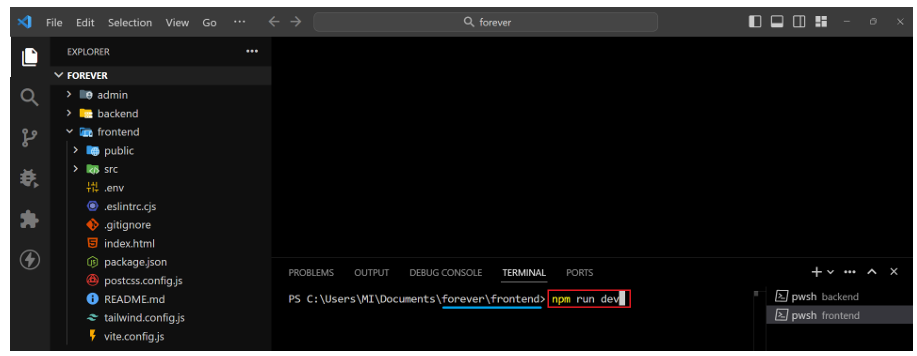

4. Nowyou will see the ‘http://localhost:5173’ link in that terminal. Open that link
 in the browser.

# ❖ Steps To Run AdminPanel of The Project

 1. Right Click on ‘admin’ folder > Select “Open In Integrated Terminal”
 2. Type “npm install” and press Enter and Wait for Installation to be
 completed (requires Internet)
 3. After that type “npm run dev” in terminal

 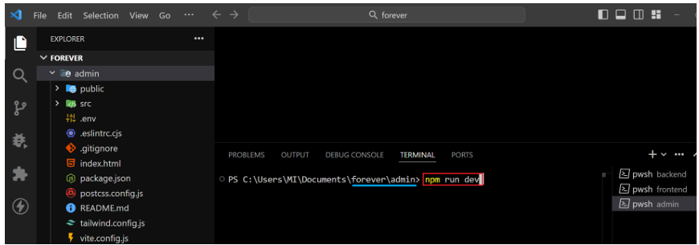

  4. Nowyou will see the ‘http://localhost:5174’ link in that terminal. Open
 that link in the browser.

